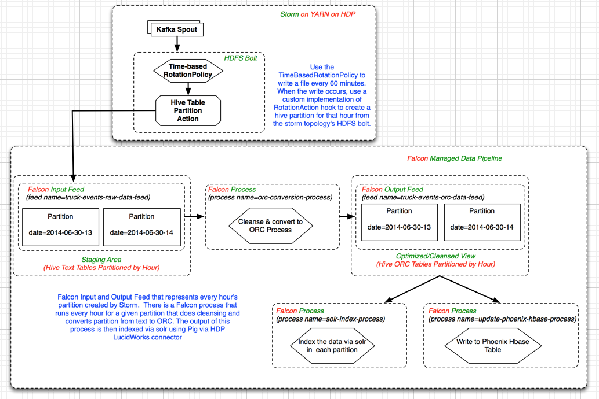

# IOT Trucking Reference Application
This project is meant to be a reference application/assembly for an IOT use case. The project consists of 4 projects:

1. **trucking-data-simulator** - Data simulator that allows you spin N number of Trucks emitting X number of events
2. **trucking-domain-objects** - Common trucking domain objects used across projects
3. **trucking-storm-topology** - Storm Topology to process trucking events in realtime
4. **trucking-env-setup** - Set of scripts to setup the cluster
5. **trucking-web-portal** - A web application that allows you to deploy the storm topoloyg and tap into the real-time trucking data using websockets from Active/MQ and Storm

## Business Use Case Setup

* Sensor devices from trucks captures events of the trucks and actions of the Driver.
* Some of these driver events are dangerous "events” such as: Lane Departure, Unsafe following distance, Unsafe tail distance
* The Business Requirement is to stream these events in, filter on violations and do real-time alerting when “lots” of erratic behavior is detected for a given driver over a short period of time.

## What does this Reference Application Demonstrate
* Stream Processing
* Search/Indexing
* Interactive Query
* Real-time CRUD
* Data Science
* Platform Capabilities including Multi-Tenancy, Security, Data Pipelines, and LIneage

## IOT Trucking App Storm Architecture 

## IOT Trucking App Data Pipline Architecture 

## Installing and Running the IOT Trucking App (Without Slider Apps)

### Cluster Setup
1. Spin up a HDP 2.2 Cluster using Ambari 2.2 - See the following link for instructions: http://docs.hortonworks.com/
2. All Services will need to be installed including Hbase, Storm, Kafka, Falcon, Hive
3. Designate one of of the nodes on the Cluster as an Edge Node with every possible client installed on it

### Install & Configure ActiveMQ 5.9.8
ActiveMQ is required for the Storm Topology to push alerts to and for the trucking-web-portal's websocket connection to show driver events in real-time
Do the following the edge Node:

1. wget http://archive.apache.org/dist/activemq/apache-activemq/5.9.0/apache-activemq-5.9.0-bin.tar.gz
2. Untar the binary
3. Start ActiveMQ by running the following: 
apache-activemq-5.9.0/bin/activemq start xbean:file:/mnt/activemq/apache-activemq-5.9.0/conf/activemq.xml
4. Verify it is up by running:
activemq/apache-activemq-5.9.0/bin/activemq status

### Install & Configure SOLR 4.10
Do the Following on the edge Node

1. Install Solr 4.10 from here: http://archive.apache.org/dist/lucene/solr/4.10.0/solr-4.10.0.tgz using instructions from here: https://cwiki.apache.org/confluence/display/solr/Installing+Solr
2. Create a solr core called truck_event_logs
3. For the core created in step 2, use schema.xml found here: XXXX

### Download and Build the Code
Do the Following on the Edge Node

1. Install Git
2. Install Maven
3. git clone https://george.vetticaden@github.com/georgevetticaden/hdp.git
6. Hite the Url

### Configure HDFS
Do the following on the edge Node

1. su hdfs
2. Run the script in hdp/reference-apps/iot-trucking-app/trucking-env-setup/environment/prod/setup/hdfs/createDirsInHDFS.sh

### Configure Hive
Do the following on the edge Node

1. su hdfs
2. Run both the ddls located in hdp/reference-apps/iot-trucking-app/trucking-env-setup/environment/prod/setup/hive

### Configure HBase
Do the following on the edge node (or where you have hbase client running)

1. Run the hbase script located in hdp/reference-apps/iot-trucking-app/trucking-env-setup/environment/prod/setup/hbase/createHBaseTables
2. This should have created 3 tables in Hbase: driver_dangerous_events, driver_dangerous_events_count and driver_events
 

### Configure Kafka
Do the following on the edge node (or where you have Kafka Broker/client running)

1. Create a kafka topic called truck_events with 5 partitions and 1 replica by executing somethign liek the following: 

/mnt/kafka/kafka_2.8.0-0.8.0/bin/kafka-create-topic.sh --zookeeper zookeeper_host:2181 --replica 1 --partition 5 --topic truck_events 

### Run the trucking-web-portal
Do the Following on the Edge Node
1. Go to the directory where you cloned the repo in section Download and Build the Code
2. cd to hdp/reference-apps/iot-trucking-app
3. mvn clean install -DskipTests=true
4. cd to trucking-web-portal
5. mvn jetty:run -X -Dservice.registry.config.location=[REPLACE_WITH_DIR_YOU_CLONED_TO]/hdp/reference-apps/iot-trucking-app/trucking-web-portal/src/main/resources/config/dev/registry
6. Hit the portal URL: http://[edge_node_hostname]:8080/iot-trucking-app/ You should See this:

